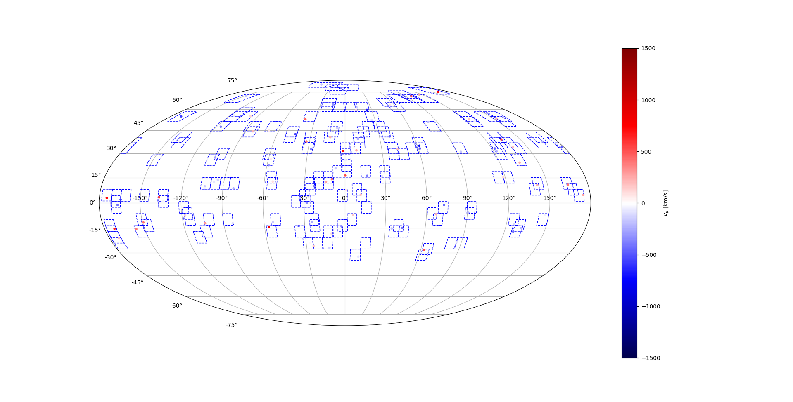

# Plots 

## Light-curves

You can plot light-curves directly after simulation or using the **SNSimSample** module.

```python
# From simulation
sim.sn_sample.plot_lc(SN_ID, mag=False, zp=25. , plot_sim=True, plot_fit=False, Jy=False)

# From SNSimSample
snsimsample.plot_lc(SN_ID, mag=False, zp=25. , plot_sim=True, plot_fit=False, Jy=False)
```

Plot sim :


Plot  fit :


The same plot can be show in magnitude :


Or in Jansky :


## Mollweide map

You can plot the  directly after simulation or using the **SNSimSample** module. But the **plot_field** option doesn't work with **SNSimSample** unless you give a field_dic and field_size.

You can pass **kwargs** for *matplotlib* scatter function.

```python
# From Simulation class :
sim.plot_ra_dec(plot_vpec=False, plot_fields=False, **kwarg)

# From SNSimSample class :
sim.plot_ra_dec(plot_vpec=False, field_dic=None, field_size=None, **kwarg)

# field_dic is like:
field_dic = {Field_ID : {'ra' : ra_in_rad, 'dec' : dec_in_rad}}

# field_size is like:
field_size = [ra_size_in_rad, dec_size_in_rad]
```

Plot without peculiar velocities :


Plot with peculiar velocities :


Adding the fields :

